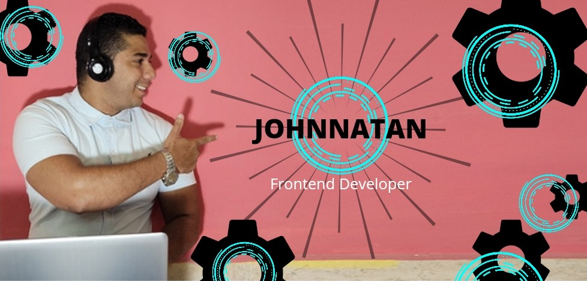

<h1 align="center">Console.log("Hello World, I'm Johnnatan 👨🏻‍💻 !!! 👋 ") </h1>

Software developer focused on frontend development (Javascript, React, Next, Vue, Css, BosStrap, and more). I create awesome solutions that help make people's daily lives easier. I continuously pursue more skills and I share my knowledge a cross communities. I'm a self-taught person with great passion for learning and sharing knowledge. Always learning something new 🚀📚

📫🤝🏻 Connect with Me

You can find me on [LinkedIn](https://www.linkedin.com/in/johnnatanreyes)

Send me an email: tanamix22@gmail.com

<h2 align="center"> 🛠 Skills & Technologies 🧑‍💻</h2>

    &nbsp;&nbsp;
    &nbsp;&nbsp;
    &nbsp;&nbsp;
    &nbsp;&nbsp;

  &nbsp;&nbsp;
  &nbsp;&nbsp;
  &nbsp;&nbsp;

